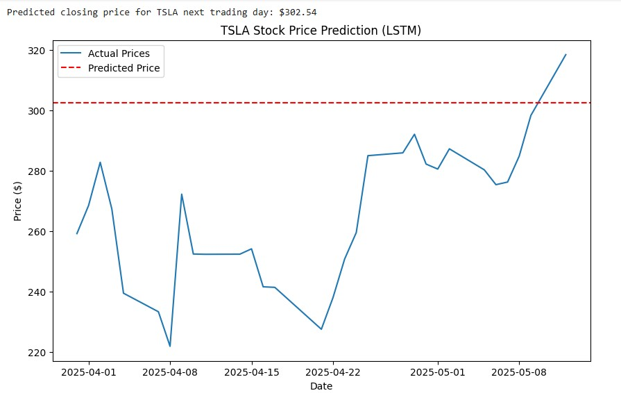

# Stock-price-prediction

In this project, we aim to predict future stock prices using deep learning models, particularly **LSTM (Long Short-Term Memory)**. LSTM is a type of recurrent neural network (RNN) that is well-suited for time series data, such as stock prices, because it can learn long-term temporal dependencies within the data.

We use historical stock price data of **Tata Global Beverages**, extracted from the **NSE (National Stock Exchange of India)**.

Specifically, we use the past **60 days** of stock prices to predict the price on the **61st day**. By observing historical patterns, the model attempts to understand the likely trend of future prices.

```python
import yfinance as yf
import numpy as np
import pandas as pd
import matplotlib.pyplot as plt
from sklearn.preprocessing import MinMaxScaler
from tensorflow.keras.models import Sequential
from tensorflow.keras.layers import LSTM, Dense

ticker = input("Enter stock ticker (e.g. AAPL): ").strip().upper()
lookback_days = 60

# Data retrieval
df = yf.download(ticker, start='2015-01-01')
data = df[['Close']].copy()

# Data scaling
scaler = MinMaxScaler(feature_range=(0, 1))
scaled_data = scaler.fit_transform(data)

# Creating training data
X = []
y = []

for i in range(lookback_days, len(scaled_data)):
    X.append(scaled_data[i - lookback_days:i, 0])
    y.append(scaled_data[i, 0])

X, y = np.array(X), np.array(y)
X = X.reshape(X.shape[0], X.shape[1], 1)

# Building the LSTM model
model = Sequential()
model.add(LSTM(units=50, return_sequences=False, input_shape=(X.shape[1], 1)))
model.add(Dense(1))
model.compile(optimizer='adam', loss='mean_squared_error')

# Training the model
model.fit(X, y, epochs=20, batch_size=32)

# Next day prediction 
last_60_days = scaled_data[-lookback_days:]
X_pred = np.reshape(last_60_days, (1, lookback_days, 1))
predicted_price_scaled = model.predict(X_pred)
predicted_price = scaler.inverse_transform(predicted_price_scaled)

print(f"\nPredicted closing price for {ticker} next trading day: ${predicted_price[0][0]:.2f}")

# Comparison chart
plt.figure(figsize=(10,6))
plt.plot(data[-30:], label="Actual Prices")
plt.axhline(y=predicted_price[0][0], color='red', linestyle='--', label='Predicted Price')
plt.title(f"{ticker} Stock Price Prediction (LSTM)")
plt.xlabel("Date")
plt.ylabel("Price ($)")
plt.legend()
plt.show()
```
## OutPut(For example):


